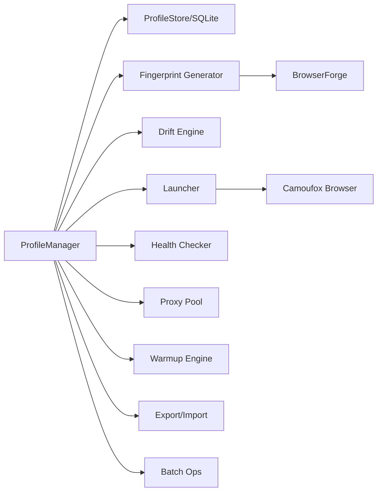
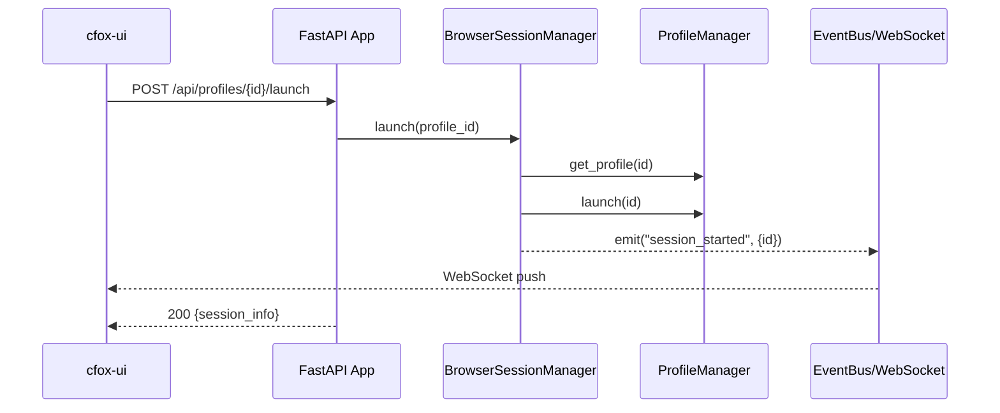
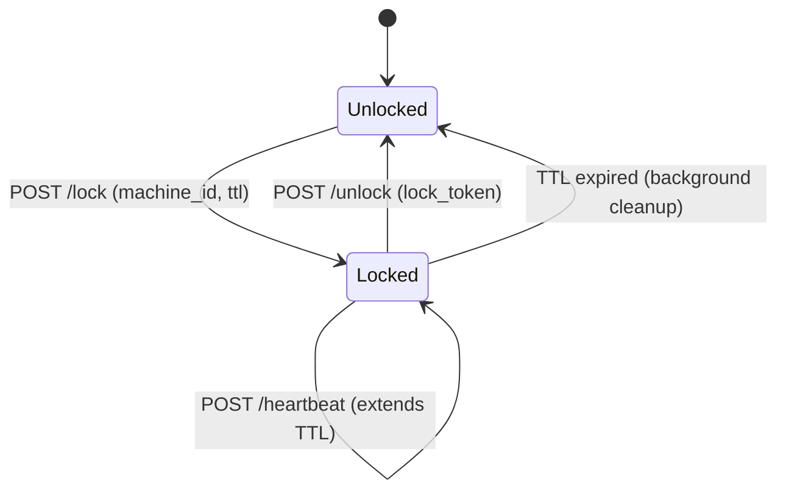

# Camoufox Profiles — Architecture Document

> **Version:** 6.0 — Aligned with implementation (Phase 1-3 complete)
> **Last updated:** 2026-05-11

---

## System Overview

Camoufox Profiles is a **full-stack antidetect browser profile management system** built around the Camoufox Firefox fork. It provides persistent fingerprint management, natural aging, cloud synchronization, and a web dashboard.

### Component Stack

```
┌─────────────────────────────────────────────────────────────────────┐
│                          cfox-ui                                     │
│              React + Vite + TypeScript                               │
│     Profiles │ Proxy Pool │ Tag Manager │ Settings                   │
│     17 components │ 2 hooks │ 4 pages │ WebSocket live updates       │
└──────────────────────────────┬──────────────────────────────────────┘
                               │ REST API + WebSocket (:7600)
┌──────────────────────────────▼──────────────────────────────────────┐
│                         cfox-local                                   │
│                    FastAPI + Uvicorn                                  │
│                                                                      │
│  ┌──────────────────────────────────────────────────────────────┐    │
│  │ Routes (7)                                                    │    │
│  │  profiles │ browser │ health │ proxies │ tags │ server │ ws   │    │
│  └──────────────────────────────────────────────────────────────┘    │
│  ┌──────────────────────────────────────────────────────────────┐    │
│  │ Core Services                                                 │    │
│  │  SessionManager  │ CloudClient │ SyncService │ UploadQueue    │    │
│  │  HeartbeatService │ EventBus                                  │    │
│  └──────────────────────────────────────────────────────────────┘    │
│  ┌──────────────────────────────────────────────────────────────┐    │
│  │ Config + Settings                                             │    │
│  │  config.json │ machine_id │ CORS │ Static file serving        │    │
│  └──────────────────────────────────────────────────────────────┘    │
└──────┬─────────────────────────────┬────────────────────────────────┘
       │                             │
       ▼                             ▼
┌──────────────────┐     ┌──────────────────────────────────────────┐
│ camoufox_profiles│     │              cfox-server                  │
│   (Core Library) │     │         FastAPI + PostgreSQL              │
│                  │     │                                           │
│  ProfileManager  │     │  ┌─────────────────────────────────────┐ │
│  ProfileStore    │     │  │ Routes (4)                           │ │
│  Fingerprint     │     │  │  profiles │ locks │ storage │ users  │ │
│  Launcher        │     │  └─────────────────────────────────────┘ │
│  DriftEngine     │     │  ┌─────────────────────────────────────┐ │
│  ProxyPool       │     │  │ Services                             │ │
│  HealthChecker   │     │  │  LockCleanupService │ StorageService │ │
│  TransferEngine  │     │  └─────────────────────────────────────┘ │
│  WarmupEngine    │     │  ┌─────────────────────────────────────┐ │
│  Batch           │     │  │ Middleware                           │ │
│                  │     │  │  API Key Auth │ HMAC-SHA256 hashing  │ │
│  SQLite (WAL)    │     │  └─────────────────────────────────────┘ │
│  SQLAlchemy 2.0  │     │                                          │
└──────────────────┘     │  PostgreSQL + File Storage                │
                         └──────────────────────────────────────────┘
```

---

## 1. Core Library (`src/camoufox_profiles/`)

The foundation layer. All other components depend on this.

### Data Flow



### Module Responsibilities

| Module | LOC | Purpose |
|--------|-----|---------|
| `models.py` | ~300 | Dataclasses: Profile, DriftSchedule, ProxyConfig, HealthReport |
| `store.py` | ~800 | Async+Sync SQLite store, WAL mode, schema migration |
| `store_sa.py` | ~500 | SQLAlchemy-based store (for PostgreSQL server) |
| `models_sa.py` | ~200 | SQLAlchemy ORM models (ProfileModel, UserModel) |
| `db.py` | ~100 | Database engine factory (SQLite + PostgreSQL) |
| `migrations.py` | ~300 | V1→V2 schema migration engine |
| `fingerprint.py` | ~200 | Camoufox fingerprint capture via BrowserForge |
| `launcher.py` | ~400 | Browser launch with IP guard + drift integration |
| `drift.py` | ~200 | Natural fingerprint aging (UA, viewport, history) |
| `proxy.py` | ~250 | Centralized proxy pool management |
| `health.py` | ~250 | Profile health diagnostics (5 check types) |
| `batch.py` | ~200 | Parallel operations (warmup, health) |
| `transfer.py` | ~230 | ZIP export/import with optional AES-256 encryption |
| `warmup.py` | ~260 | Browser warmup with popular sites + Alexa top lists |
| `manager.py` | ~700 | High-level API orchestrating all features |
| `cli.py` | ~500 | CLI entry point (`cfox` command) |
| `exceptions.py` | ~60 | Custom exception hierarchy |

### Key Design Decisions

- **SQLite in WAL mode** for local storage — concurrent reads, single-writer
- **UUID4** profile IDs — shared ID space between local and cloud
- **Fingerprint immutability** — once created, core fingerprint never changes
- **Drift is cosmetic only** — UA version, viewport jitter, history length
- **IP safety guard is mandatory** — cannot be disabled, protects geo consistency

---

## 2. Desktop Server (`cfox_local/`)

Single-process FastAPI server wrapping ProfileManager with REST + WebSocket API.

### Request Flow



### BrowserSessionManager

The `session_manager.py` (~600 LOC) is the most complex module in cfox-local:

- **PID tracking** — Monitors browser process via psutil
- **Crash recovery** — Recovers sessions from `sessions.db` on startup
- **Graceful shutdown** — Stops all browsers on server shutdown
- **Concurrent sessions** — Multiple profiles can run simultaneously
- **Status broadcasting** — Pushes events via EventBus/WebSocket

### Route Modules

| Route | Prefix | Endpoints |
|-------|--------|-----------|
| `profiles.py` | `/api/profiles` | CRUD, list with filters |
| `browser.py` | `/api/profiles` | Launch, stop, sessions, warmup |
| `health.py` | `/api/profiles` | Health check, drift history |
| `proxies.py` | `/api/proxies` | Proxy pool CRUD, bulk import, health check |
| `tags.py` | `/api/tags` | Tag CRUD, bulk operations |
| `server.py` | `/api/server` | Cloud connection status, connect/disconnect |
| `ws.py` | `/api/ws` | WebSocket endpoint, EventBus singleton |

### Cloud Services

| Service | Purpose |
|---------|---------|
| `cloud_client.py` | HTTP client SDK for cfox-server (connect, CRUD, lock, upload, heartbeat) |
| `heartbeat_service.py` | Periodic heartbeat for active cloud sessions (30s interval) |
| `sync_service.py` | Profile sync orchestrator (copy-before-zip, clean extract) |
| `upload_queue.py` | Background upload queue (dedup, max 3 concurrent, exp backoff) |

### Static File Serving

cfox-local serves the built Web UI as static files:

```python
# In app.py
ui_dist = Path(__file__).parent.parent / "cfox_ui" / "dist"
if ui_dist.exists():
    app.mount("/", StaticFiles(directory=str(ui_dist), html=True))
```

---

## 3. Cloud Server (`cfox_server/`)

Self-hosted profile management server with PostgreSQL backend.

### Multi-User Model

```
Users (API Key Auth)
  ├── admin: Full access, user management
  └── member: Profile CRUD, lock, upload/download
```

- API keys hashed with HMAC-SHA256
- Bootstrap admin created on first startup
- Middleware extracts and validates API key from `X-API-Key` header

### Lock Protocol



- Lock owned by `machine_id` + `lock_token`
- TTL defaults to 120 minutes
- Background cleanup every 60 seconds
- Expired locks can be re-acquired by other machines

### Essential Data Storage

```
data/essential_data/
└── {profile_id}/
    ├── v1.zip          # Version 1
    ├── v2.zip          # Version 2
    ├── v3.zip          # Version 3 (latest)
    └── metadata.json   # Version metadata + checksums
```

- SHA-256 checksum on upload + download verification
- Server keeps last N versions (configurable, default 3)
- Rollback API to restore previous versions

### Configuration (Environment Variables)

| Variable | Type | Default | Description |
|----------|------|---------|-------------|
| `DATABASE_URL` | str | `postgresql+asyncpg://...` | PostgreSQL connection |
| `STORAGE_DIR` | Path | `data/essential_data` | File storage root |
| `HOST` | str | `0.0.0.0` | Bind address |
| `PORT` | int | `8700` | Server port |
| `LOCK_TTL_MINUTES` | int | `120` | Lock auto-expire |
| `LOCK_CLEANUP_INTERVAL_SECONDS` | int | `60` | Cleanup frequency |
| `MAX_VERSIONS` | int | `3` | Version retention count |
| `ADMIN_API_KEY` | str | _(auto)_ | Initial admin key |

---

## 4. Web Dashboard (`cfox_ui/`)

React + Vite + TypeScript single-page application.

### Page Architecture

| Page | Component | Features |
|------|-----------|----------|
| Profiles | `Profiles.tsx` (800+ LOC) | Grid/list view, search, tag filter, bulk select, launch/stop, inline edit, batch create, import/export |
| Proxy Pool | `ProxyPool.tsx` | Table view, bulk import, health check, tag filter |
| Tag Manager | `TagManager.tsx` | CRUD, profile counts, rename, merge |
| Settings | `Settings.tsx` | Directory browser, storage stats, cloud config, danger zone |

### Data Flow

```
useProfiles() hook
  ├── Initial fetch: GET /api/profiles
  ├── WebSocket: /api/ws (auto-reconnect, debounced refresh)
  └── Mutations: POST/PUT/DELETE → refetch
```

### Component Inventory (17 components)

| Component | Purpose |
|-----------|---------|
| `ProfileCard.tsx` | Card with status badge + actions |
| `CreateProfileModal.tsx` | Create profile dialog |
| `BatchCreateModal.tsx` | Batch create dialog |
| `BulkEditModal.tsx` | Bulk edit tags/proxy |
| `ConfirmModal.tsx` | Confirmation dialog |
| `HealthModal.tsx` | Health report display |
| `ImportModal.tsx` | Import profile dialog |
| `InlineEditPopup.tsx` | Inline name/notes editing |
| `InlineProxyEditPopup.tsx` | Inline proxy config editing |
| `ProxyAddModal.tsx` | Add proxy dialog |
| `ProxyBulkBar.tsx` | Bulk action toolbar |
| `ProxyBulkImportModal.tsx` | Bulk proxy import |
| `ProxyTable.tsx` | Proxy list table |
| `ProxyToolbar.tsx` | Proxy toolbar with filters |
| `StatusBadge.tsx` | Status indicator (idle/running) |
| `TagInput.tsx` | Tag input with autocomplete |
| `Icons.tsx` | SVG icon components |

---

## 5. Testing Architecture

### Test Layers

```
┌──────────────────────────────────────────────────────────────┐
│ E2E Tests (tests/e2e/) — 42 tests, 6 suites                  │
│  ┌─────────────────────────────────────────────────────────┐ │
│  │ Suites 1-3, 6: In-process (ASGI transport, no ports)    │ │
│  │  • test_server_api.py    (4 tests)                      │ │
│  │  • test_local_api.py     (12 tests)                     │ │
│  │  • test_cloud_client.py  (8 tests)                      │ │
│  │  • test_cross_system.py  (5 tests)                      │ │
│  └─────────────────────────────────────────────────────────┘ │
│  ┌─────────────────────────────────────────────────────────┐ │
│  │ Suites 4-5: Subprocess server (:9600) + real HTTP       │ │
│  │  • test_ui_settings.py   (7 tests)                      │ │
│  │  • test_ui_profiles.py   (6 tests)                      │ │
│  └─────────────────────────────────────────────────────────┘ │
├──────────────────────────────────────────────────────────────┤
│ Unit Tests                                                    │
│  • test_fingerprint.py — Fingerprint generation               │
│  • test_store.py       — SQLite store operations              │
│  • test_warmup.py      — Warmup engine                        │
├──────────────────────────────────────────────────────────────┤
│ Browser Tests (tests/async/, browser-tests/)                  │
│  • Playwright-based browser automation tests                  │
│  • Fingerprint consistency verification                       │
└──────────────────────────────────────────────────────────────┘
```

### Fixtures (conftest.py)

| Fixture | Scope | Purpose |
|---------|-------|---------|
| `server_app` | function | cfox-server FastAPI app (in-memory SQLite) |
| `admin_client` | function | Authenticated ASGI client for server |
| `local_app` | function | cfox-local FastAPI app (temp directory) |
| `local_client` | function | ASGI client for local server |
| `ui_server` | module | Real subprocess on :9600 (for UI tests) |

### Custom Markers

| Marker | Purpose |
|--------|---------|
| `@pytest.mark.real_browser` | Requires Camoufox binary (skip in CI) |
| `@pytest.mark.ui` | Requires built UI + subprocess server |

---

## 6. Build System

### Firefox Build Pipeline

```mermaid
graph LR
    Fetch[make fetch] --> Setup[make setup/git-fetch]
    Setup --> Dir[make dir/git-dir]
    Dir --> Bootstrap[make bootstrap]
    Bootstrap --> Build[make build]
    Build --> Package[make package-{os}]
    Package --> Release[GitHub Release]
```

### CI/CD

- **Build workflow** (`.github/workflows/build.yml`): Cross-platform Firefox build (Linux, Windows, macOS × x86_64, arm64, i686)
- **CI workflow** (`.github/workflows/ci.yml`): Python tests + UI lint

---

## 7. Deployment Models

### Desktop (cfox-local only)

```
User's machine
├── cfox-local (FastAPI :7600)
├── cfox-ui (built static files)
├── SQLite database (~/.cfox/)
├── Profile data (~/.cfox/profiles/)
└── Camoufox browser binary
```

### Team (cfox-local + cfox-server)

```
Each team member's machine          Shared server
├── cfox-local (:7600)              ├── cfox-server (:8700)
├── cfox-ui                         ├── PostgreSQL
├── Local SQLite                    ├── Essential data storage
└── Camoufox browser                └── User management
```

Profiles sync via HTTPS between local and server. Locks prevent concurrent access.
