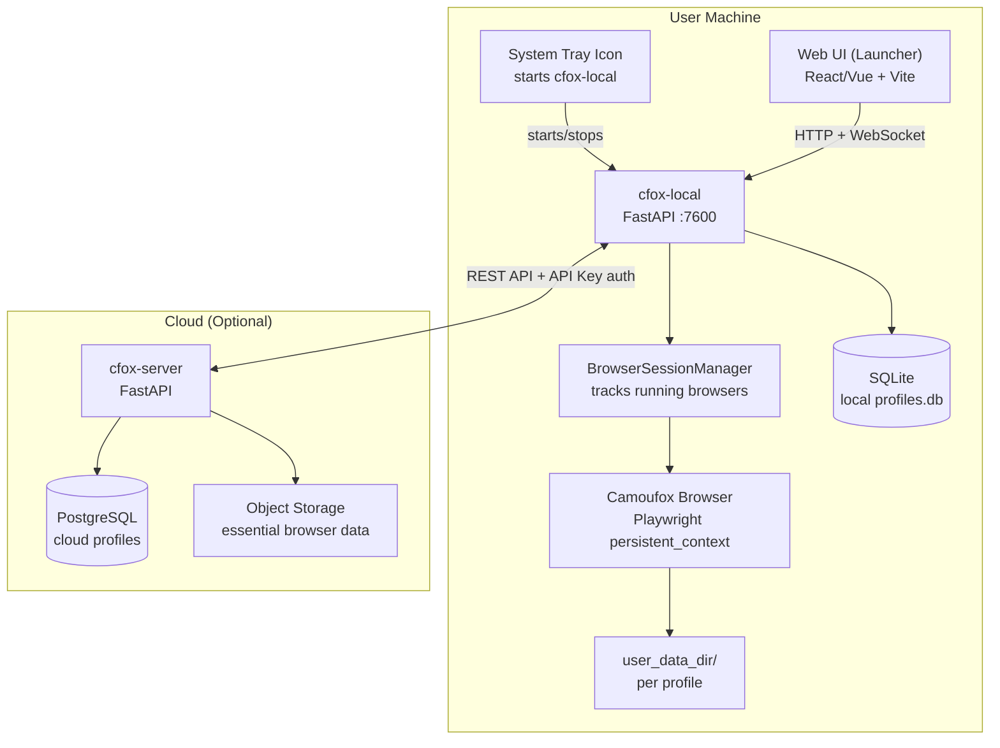
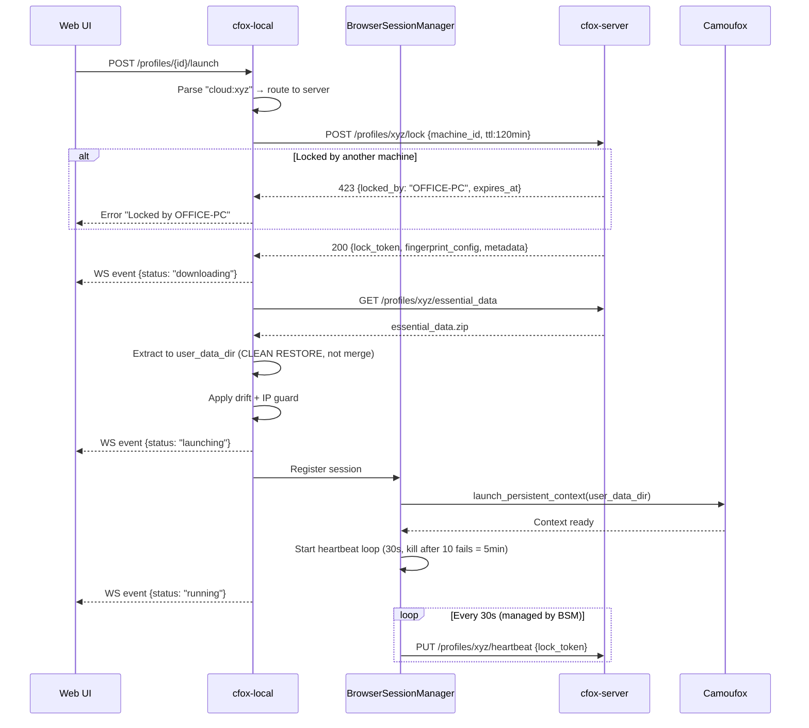
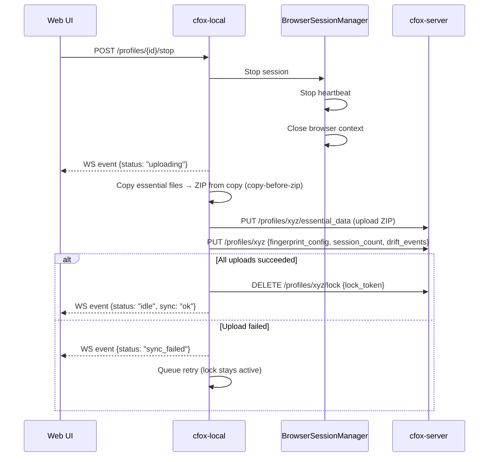

# cfox-server Architecture — v5-final (self-reviewed)

## Overview

```
Web UI (Launcher) ──── cfox-local (FastAPI, localhost:7600) ──── Local Profiles (SQLite)
                              │                                         │
                         WebSocket ←── real-time events            user_data_dir/
                              │
                              │ (optional connection)
                              ▼
                       cfox-server (Cloud/VPS) ──── Cloud Profiles (PostgreSQL)
                                                         │
                                                    Object Storage (essential data)
```

**Dual-source launcher**: User sees unified profile list from local SQLite + remote cfox-server.

---

## 1. System Architecture



### Component Responsibilities

| Component | Role | Tech |
|-----------|------|------|
| **System Tray** | Khởi động cfox-local, menu nhanh (open UI, quit) | Python + pystray |
| **Web UI** | Giao diện chính: profile list, launch/stop, proxy, health, settings | React/Vue + Vite |
| **cfox-local** | Unified REST + WebSocket API. Merge local + cloud. Chạy Camoufox. | FastAPI, uvicorn |
| **BrowserSessionManager** | Theo dõi browsers đang chạy, xử lý crash, heartbeat | In-process singleton |
| **cfox-server** | Cloud: profile CRUD, lock management, essential data storage | FastAPI, PostgreSQL |

---

## 2. Dual-Source Profile Model

### Profile ID Strategy

ID is always a clean UUID. `source` is a separate field — never encoded into the ID.
When calling profile-specific endpoints, pass `source` as query param to disambiguate:

```
GET /api/profiles/{uuid}?source=local
GET /api/profiles/{uuid}?source=cloud
```

> **Note:** UUID collision between local SQLite and cloud PostgreSQL is astronomically
> unlikely. If it occurs, `source` param resolves it. No prefix encoding needed.

### Unified API Response

```json
// GET /api/profiles
{
  "profiles": [
    {
      "id": "4c412548-a2b0-4c8d-921e-bb1fe363bc45",
      "name": "shop-account-1",
      "source": "local",
      "os": "windows",
      "status": "idle",
      "tags": ["ecommerce"],
      "sessions": 42
    },
    {
      "id": "f7a82e3d-1234-5678-abcd-ef0123456789",
      "name": "farm-account-3",
      "source": "cloud",
      "os": "windows",
      "status": "running",
      "locked_by": "this_machine",
      "tags": ["farming"],
      "sessions": 18
    }
  ],
  "server_connected": true
}
```

### Profile Status State Machine

```
                    ┌──── lock failed (423)
                    │
idle ──── launch ──┼──── lock OK ──── downloading ──── launching ──── running
                                                                        │
                                                            stop/crash ─┘
                                                                        │
                                                               uploading ──── unlocking ──── idle
                                                                   │
                                                              upload fail ──── retry_pending
```

### Operations by Source

| Operation | Local | Cloud |
|-----------|-------|-------|
| List | Read SQLite | Fetch cfox-server |
| Create | Write SQLite, generate fingerprint locally | POST cfox-server, generate fingerprint locally then push |
| Launch | Direct launch | Lock → Download essential → Launch |
| Close | Update session | Upload essential → Update metadata → Unlock |
| Delete | Delete SQLite + user_data_dir | DELETE cfox-server + delete local cache |
| Health | Local check | Local check (fingerprint already cached) |

---

## 3. Selective Sync — Essential Data Only

### What Gets Synced

```
SYNC (~10 MB):
├── cookies.sqlite                    ← Login sessions, auth tokens
├── cookies.sqlite-wal
├── storage/default/https+++*/        ← Website localStorage + IndexedDB + ServiceWorker + Cache API
│   (excludes moz-extension)
├── webappsstore.sqlite               ← Legacy localStorage
└── SiteSecurityServiceState.bin      ← HSTS preload state (~1KB)

NOT SYNCED (auto-regenerated):
├── cache2/                           ← HTTP cache (63 MB)
├── storage/default/moz-extension+++*/← Extension data (66 MB)
├── startupCache/                     ← Firefox startup cache (13 MB)
├── places.sqlite                     ← Browsing history (warmup rebuilds)
├── favicons.sqlite                   ← Favicons
├── shader-cache/                     ← GPU shaders
├── permissions.sqlite                ← Site permissions
└── sessionstore.jsonlz4              ← Last open tabs
```

> **Note:** `storage/default/https+++*/` includes IndexedDB (`idb/`), Service Workers (`sw/`),
> and Cache API (`cache/`) for each origin. This covers most auth persistence mechanisms
> used by modern web apps. For profiles requiring 100% session guarantee, a future
> `sync_mode: "full"` option will sync everything except `cache2/` and `startupCache/`.

### Size Growth Monitoring

Essential data grows as user visits more sites. Tương lai cần monitoring:

```
10 sites visited:    ~10 MB (baseline after warmup)
50 sites visited:    ~20-30 MB (typical)
500+ sites visited:  ~50-80 MB (heavy usage)

Action thresholds:
├── < 50 MB:   full sync, no concern
├── 50-100 MB: warning in health check, suggest cleanup
└── > 100 MB:  offer selective cleanup (remove old site storage)
```

Hiện tại full sync vẫn OK. Delta sync có thể thêm sau nếu cần.

### Cloud Storage Format

```
/profiles/{profile_id}/
├── essential_data.zip          # ~10MB, current version, no encryption
├── history/                    # version retention (last 3)
│   ├── essential_data_v42.zip
│   └── essential_data_v41.zip
├── version: 43                 # incremental counter (used for conflict detection)
├── checksum: "sha256:abc..."   # integrity verification
└── uploaded_at: timestamp
```

No encryption. Server is trusted.

### Conflict Detection (Optimistic Concurrency)

Upload requires `If-Match` header with expected version:

```
PUT /profiles/{id}/essential_data
Header: If-Match: 42              # base_version from session (downloaded version)
Header: Content-SHA256: abc123... # integrity check
Body: essential_data.zip

Server:
  if current_version == 42 → accept, set version = 43, store checksum
  if current_version != 42 → 409 Conflict
  if checksum mismatch     → 400 Bad Request
```

Client verifies download:
```
GET /profiles/{id}/essential_data
Response includes: Content-SHA256: abc123...
Client: verify SHA-256 after download, reject if mismatch
```

Same applies to metadata updates:

```
PUT /profiles/{id}
Header: If-Match: 42
Body: {fingerprint_config, session_count, ...}

Server:
  if current_version != 42 → 409 Conflict
```

UI handles 409 with semantic context:
```
"Bạn đang làm việc trên phiên bản v42.
 Trong khi đó, máy khác đã cập nhật lên v43.
 [Ghi đè (mất dữ liệu v43)] [Bỏ dữ liệu local] [Xem chi tiết]"
```

---

## 4. Cloud Profile Lifecycle

### Launch Flow



### Close Flow



### Browser Crash Handling (BSM)

```python
# BrowserSessionManager detects crash:
# 1. Playwright context disconnects unexpectedly
# 2. BSM catches disconnect event

async def on_browser_disconnect(session):
    # Browser crashed — essential data is still on disk (user_data_dir intact)
    try:
        await upload_essential_data(session.profile_id, base_version=session.base_version)
        await update_metadata(session.profile_id)
        await release_lock(session.profile_id)
        notify_ui("Profile closed (browser crashed), data synced ✓")
    except Exception:
        notify_ui("Browser crashed, sync failed — will retry")
        upload_queue.enqueue(session)  # deduplicated by profile_id
```

### Essential Data Restore (Clean, Never Merge)

```python
ESSENTIAL_PATTERNS = [
    "cookies.sqlite*",
    "webappsstore.sqlite*",
    "SiteSecurityServiceState.bin",
    "storage/default/https+++*/",
]

async def restore_essential_data(user_data_dir: Path, zip_path: Path, cache_policy: str = "clear"):
    # 1. DELETE essential files
    for pattern in ESSENTIAL_PATTERNS:
        for match in user_data_dir.glob(pattern):
            shutil.rmtree(match) if match.is_dir() else match.unlink()
    
    # 2. Clear cache (default) — prevents stale ETag/auth cache inconsistency
    if cache_policy == "clear":
        for cache_dir in ["cache2", "startupCache"]:
            p = user_data_dir / cache_dir
            if p.exists():
                shutil.rmtree(p)
    
    # 3. Extract clean state from ZIP
    with zipfile.ZipFile(zip_path) as zf:
        zf.extractall(user_data_dir)
```

### Essential Data Collection (Copy-Before-Zip)

```python
async def collect_essential_data(user_data_dir: Path) -> Path:
    """Copy essential files first, then ZIP from copy. Never ZIP from live dir."""
    tmp_dir = Path(tempfile.mkdtemp())
    try:
        for pattern in ESSENTIAL_PATTERNS:
            for src in user_data_dir.glob(pattern):
                dst = tmp_dir / src.relative_to(user_data_dir)
                dst.parent.mkdir(parents=True, exist_ok=True)
                if src.is_dir():
                    shutil.copytree(src, dst)
                else:
                    shutil.copy2(src, dst)
        
        await asyncio.sleep(0.5)  # filesystem settle after browser close
        
        zip_path = tmp_dir.parent / f"essential_{uuid4().hex[:8]}.zip"
        with zipfile.ZipFile(zip_path, 'w', zipfile.ZIP_DEFLATED) as zf:
            for f in tmp_dir.rglob('*'):
                if f.is_file():
                    zf.write(f, f.relative_to(tmp_dir))
        return zip_path
    finally:
        shutil.rmtree(tmp_dir, ignore_errors=True)
```

> **IMPORTANT:** Never merge essential data. Always delete → extract.
> Never ZIP from live user_data_dir. Always copy → ZIP from copy.
> Prevents crash-induced WAL corruption in uploaded data.

### Local Profile Launch (Unchanged)

```
1. Read profile from SQLite
2. Apply drift + IP guard
3. Launch Camoufox
4. BSM tracks session (no heartbeat needed, no lock)
```

---

## 5. Lock Protocol

### Rules

```
1. Lock BEFORE launch, unlock ONLY AFTER successful upload
2. TTL = 2 hours, heartbeat every 30s extends TTL
3. No heartbeat after TTL → auto-unlock
4. Force unlock: admin action via API or UI
5. Lock ownership: server validates BOTH lock_token + machine_id on every lock endpoint
6. BSM kill timeline on heartbeat failure:
   - 60s (2 fails):  UI warning yellow "Mất kết nối server"
   - 150s (5 fails): UI warning red "Browser sẽ đóng trong 2.5 phút"
   - 300s (10 fails): KILL browser → prevents duplicate fingerprint
7. Session stores base_version (downloaded essential_data version)
8. Lock response includes previous_lock info for race detection:
   - If last_heartbeat < 60s ago → UI warning "Profile có thể đang chạy trên máy khác"
```

### Edge Cases

| Scenario | Handling |
|----------|----------|
| Machine crash | BSM detects disconnect → try upload → unlock. If BSM itself dies → TTL auto-unlock. On restart, BSM recovers from `running_sessions` table (with playwright context ping to detect zombies). |
| Network drop < 60s | Heartbeat retries. Browser continues normally. |
| Network drop 60s-300s | UI warning escalation (yellow→red). Browser continues. |
| Network drop > 300s (5 min) | BSM kills browser → prevents duplicate fingerprint. Data saved locally, upload queued. |
| Upload fails after close | Lock held. Deduplicated retry queue (max 3 concurrent). UI shows "sync pending". |
| User force-quits launcher | OS shutdown hook (atexit) tries upload+unlock. If fails → TTL + session recovery on restart. |
| TTL expired, machine comes back | Upload with `If-Match: base_version` → 409 if another machine pushed → conflict dialog with semantic context. |

---

## 6. cfox-local API

```
Profile Management (unified local + cloud):
  GET    /api/profiles                         → merged list
  POST   /api/profiles                         → create {source: "local"|"cloud", ...}
  GET    /api/profiles/{prefixed_id}           → detail
  PUT    /api/profiles/{prefixed_id}           → update metadata
  DELETE /api/profiles/{prefixed_id}           → delete

Browser Control:
  POST   /api/profiles/{prefixed_id}/launch    → start browser
  POST   /api/profiles/{prefixed_id}/stop      → stop browser + sync
  GET    /api/sessions                         → list running browsers
  POST   /api/profiles/{prefixed_id}/warmup    → warmup with popular sites

Health & Drift:
  GET    /api/profiles/{prefixed_id}/health    → health check
  GET    /api/profiles/{prefixed_id}/drift     → drift event history

Proxy Pool (cloud primary when connected, local fallback):
  GET    /api/proxies                          → list (cloud if connected, else local)
  POST   /api/proxies                          → add
  DELETE /api/proxies/{id}                     → remove
  POST   /api/proxies/check                    → health check all
  POST   /api/proxies/{id}/promote             → copy local proxy to cloud
  POST   /api/proxies/{id}/demote              → copy cloud proxy to local

Server Connection:
  GET    /api/server/status                    → {connected, url, latency}
  POST   /api/server/connect                   → {url, api_key}
  POST   /api/server/disconnect                → disable cloud

Real-time (WebSocket):
  WS     /ws/events                            → stream of status changes
```

### WebSocket Events

```json
// Browser status changes
{"type": "browser_status", "profile_id": "cloud:xyz", "status": "running"}
{"type": "browser_status", "profile_id": "cloud:xyz", "status": "uploading"}
{"type": "browser_status", "profile_id": "local:abc", "status": "idle"}

// Sync events
{"type": "sync_status", "profile_id": "cloud:xyz", "status": "ok"}
{"type": "sync_status", "profile_id": "cloud:xyz", "status": "failed", "error": "..."}

// Server connection
{"type": "server_connection", "status": "connected"}
{"type": "server_connection", "status": "disconnected", "error": "timeout"}
```

---

## 7. cfox-server API

### Authentication

Mỗi machine có API key, cấu hình khi connect:

```
POST /api/server/connect {"url": "https://cfox.myserver.com", "api_key": "sk-..."}
```

Mọi request từ cfox-local → cfox-server đều kèm header:

```
Authorization: Bearer sk-...
```

Server validate API key. Đơn giản, không cần OAuth/JWT phức tạp.

### API Endpoints

```
Auth:
  POST   /api/auth/verify                     → validate API key

Profiles:
  GET    /api/profiles                         → list
  POST   /api/profiles                         → create
  GET    /api/profiles/{id}                    → get with metadata
  PUT    /api/profiles/{id}                    → update metadata + fingerprint
  DELETE /api/profiles/{id}                    → delete + cleanup storage

Lock (all endpoints validate lock_token + machine_id):
  POST   /api/profiles/{id}/lock               → acquire {machine_id, ttl} → returns {lock_token, previous_lock}
  PUT    /api/profiles/{id}/heartbeat          → extend TTL {lock_token, machine_id}
  DELETE /api/profiles/{id}/lock               → release {lock_token, machine_id}
  DELETE /api/profiles/{id}/lock/force         → admin force-unlock

Essential Data:
  GET    /api/profiles/{id}/essential_data     → download ZIP (includes Content-SHA256 header)
  PUT    /api/profiles/{id}/essential_data     → upload ZIP (requires If-Match + Content-SHA256 + lock_token)
  GET    /api/profiles/{id}/essential_data/info → {version, size, checksum, uploaded_at}
  GET    /api/profiles/{id}/essential_data/versions → list retained versions
  POST   /api/profiles/{id}/essential_data/rollback/{version} → rollback to version

Proxy Pool (cloud-scoped):
  GET    /api/proxies
  POST   /api/proxies
  DELETE /api/proxies/{id}
  POST   /api/proxies/check
```

---

## 8. Proxy Pool Scope

Proxy pool tách biệt giữa local và cloud:

```
Local proxy pool:
├── Stored in local SQLite (profiles.db → proxy_pool table)
├── Chỉ local profiles dùng
├── Managed via cfox-local API
└── Không sync lên server

Cloud proxy pool:
├── Stored in PostgreSQL (cfox-server)
├── Chỉ cloud profiles dùng  
├── Managed via cfox-server API
└── cfox-local hiển thị read-only cho UI (nếu cần)
```

Khi user tạo cloud profile và muốn bind proxy → proxy phải đã tồn tại trong cloud proxy pool.

---

## 9. cfox-local Lifecycle

### Startup

```
User double-clicks "Camoufox Launcher"
  → Starts cfox-local (FastAPI on localhost:7600)
  → Shows system tray icon (pystray)
  → Opens browser to http://localhost:7600 (Web UI served by cfox-local)
```

### Shutdown

```
User clicks "Quit" from tray menu
  → BSM checks for running browsers
  → If browsers running: "Close all browsers first?" dialog
  → Close all browsers → upload essential data → unlock
  → Shutdown FastAPI server
  → Exit
```

### Web UI Serving

cfox-local serves the built Web UI as static files:

```python
# cfox_local/app.py
from fastapi.staticfiles import StaticFiles

app.mount("/", StaticFiles(directory="cfox_ui/dist", html=True))
```

Single process. Không cần chạy Vite dev server riêng trong production.

---

## 10. Database Schemas

### cfox-server (PostgreSQL)

```sql
CREATE TABLE profiles (
    id UUID PRIMARY KEY DEFAULT gen_random_uuid(),
    name TEXT UNIQUE NOT NULL,
    created_at TIMESTAMPTZ NOT NULL DEFAULT now(),
    last_used_at TIMESTAMPTZ,
    target_os TEXT NOT NULL,
    fingerprint_config JSONB NOT NULL,
    
    -- Proxy
    proxy_id UUID REFERENCES proxy_pool(id),
    proxy_server TEXT,
    proxy_username TEXT,
    proxy_password TEXT,
    
    -- Drift
    drift_schedule JSONB DEFAULT '{}',
    firefox_base_version INTEGER,
    
    -- Metadata
    tags JSONB DEFAULT '[]',
    notes TEXT DEFAULT '',
    total_sessions INTEGER DEFAULT 0,
    warmup_completed BOOLEAN DEFAULT false,
    
    -- IP tracking
    creation_ip TEXT,
    creation_region TEXT,
    last_known_ip TEXT,
    last_known_region TEXT,
    
    -- Lock
    locked_by TEXT,
    lock_token UUID,
    locked_at TIMESTAMPTZ,
    lock_expires_at TIMESTAMPTZ,
    
    -- Sync
    essential_data_version INTEGER DEFAULT 0,
    essential_data_size_bytes BIGINT DEFAULT 0,
    essential_data_checksum TEXT,             -- SHA-256 of current ZIP
    sync_incomplete BOOLEAN DEFAULT false,    -- true when metadata update failed after data upload
    last_synced_at TIMESTAMPTZ,
    last_sync_machine TEXT,
    last_heartbeat_at TIMESTAMPTZ             -- for race detection (previous_lock)
);

CREATE TABLE drift_events (
    id UUID PRIMARY KEY DEFAULT gen_random_uuid(),
    profile_id UUID REFERENCES profiles(id) ON DELETE CASCADE,
    event_type TEXT NOT NULL,
    old_value TEXT,
    new_value TEXT,
    created_at TIMESTAMPTZ NOT NULL DEFAULT now()
);

CREATE TABLE proxy_pool (
    id UUID PRIMARY KEY DEFAULT gen_random_uuid(),
    server TEXT NOT NULL,
    username TEXT,
    password TEXT,
    tags JSONB DEFAULT '[]',
    is_alive BOOLEAN DEFAULT true,
    last_checked_at TIMESTAMPTZ,
    last_latency_ms INTEGER,
    last_ip TEXT,
    created_at TIMESTAMPTZ NOT NULL DEFAULT now()
);

CREATE INDEX idx_lock_expires ON profiles(lock_expires_at) 
    WHERE locked_by IS NOT NULL;
CREATE INDEX idx_profiles_tags ON profiles USING GIN(tags);
```

### cfox-local (SQLite — existing V2, no changes)

Local profiles table stays as-is. No cloud-related columns needed.

---

## 11. Project Structure

```
camoufox-profiles/
├── src/camoufox_profiles/         # V2 Core (unchanged)
│   ├── models.py                  # Profile, DriftSchedule, etc.
│   ├── store.py                   # Local SQLite store
│   ├── launcher.py                # Browser launch (drift + IP guard)
│   ├── drift.py                   # Drift engine
│   ├── fingerprint.py             # BrowserForge fingerprint capture
│   ├── warmup.py                  # Site warmup
│   ├── health.py                  # Health diagnostics
│   ├── proxy.py                   # Local proxy pool
│   ├── transfer.py                # ZIP export/import
│   ├── batch.py                   # Parallel ops
│   ├── cli.py                     # cfox CLI (standalone, still works)
│   └── exceptions.py
│
├── cfox_local/                    # Local API Server
│   ├── app.py                     # FastAPI + static UI serving
│   ├── session_manager.py         # BrowserSessionManager (persisted to SQLite)
│   ├── routes/
│   │   ├── profiles.py            # Unified CRUD (local + cloud)
│   │   ├── browser.py             # Launch / stop / status
│   │   ├── proxies.py             # Proxy pool (cloud primary / local fallback)
│   │   ├── server.py              # Cloud connection management
│   │   └── ws.py                  # WebSocket event stream
│   ├── services/
│   │   ├── profile_service.py     # Merges local + cloud, source routing
│   │   ├── sync_service.py        # Essential data collect/extract/upload/download
│   │   ├── heartbeat_service.py   # Background heartbeat + kill on 10x fail (5 min)
│   │   ├── upload_queue.py        # Rate-limited upload queue (max 3 concurrent)
│   │   └── cloud_client.py        # HTTP client for cfox-server API
│   ├── config.py                  # machine_id, server URL, API key
│   └── tray.py                    # System tray (pystray)
│
├── cfox_server/                   # Cloud API Server
│   ├── app.py                     # FastAPI app
│   ├── routes/
│   │   ├── profiles.py            # Profile CRUD
│   │   ├── locks.py               # Lock / heartbeat / unlock
│   │   ├── storage.py             # Essential data upload/download
│   │   ├── proxies.py             # Cloud proxy pool
│   │   └── auth.py                # API key validation
│   ├── services/
│   │   ├── profile_service.py
│   │   ├── lock_service.py        # TTL expiry cron, cleanup
│   │   └── storage_service.py     # Filesystem / S3 backend
│   ├── db.py                      # asyncpg / SQLAlchemy
│   ├── config.py
│   └── Dockerfile                 # Production deployment
│
├── cfox_ui/                       # Web UI
│   ├── src/
│   │   ├── App.tsx
│   │   ├── hooks/useWebSocket.ts  # Real-time event stream
│   │   ├── pages/
│   │   │   ├── Profiles.tsx       # Unified list (local + cloud)
│   │   │   ├── ProfileDetail.tsx  # Health, drift history, edit
│   │   │   ├── ProxyPool.tsx      # Local proxy management
│   │   │   └── Settings.tsx       # Server connection, preferences
│   │   └── components/
│   │       ├── ProfileCard.tsx    # Card with status badge + source icon
│   │       ├── LaunchButton.tsx   # Launch / stop with loading states
│   │       ├── SyncIndicator.tsx  # Upload/download progress
│   │       └── HealthBadge.tsx    # ✓ ⚠ ✗ severity display
│   ├── package.json
│   └── vite.config.ts
│
├── pyproject.toml
└── README.md
```

---

## 12. Implementation Phases

### Phase 1: cfox-local API — Wrap V2 for local profiles
- FastAPI server + BrowserSessionManager
- REST API for local profiles only (no cloud)
- WebSocket event stream
- System tray launcher

### Phase 2: Web UI
- Profile list, launch/stop with real-time status
- Proxy pool, health dashboard
- Settings page (placeholder for server connection)

### Phase 3: cfox-server + Cloud Sync
- PostgreSQL schema + API
- Lock protocol (lock, heartbeat, TTL, force-unlock)
- Essential data sync (collect/restore with copy-before-zip + clean extract)
- cfox-local dual-source merge + source routing
- Upload queue with dedup + exponential backoff
- API key auth
- Version retention (last 3)

### Phase 4: Polish
- Essential data size monitoring + cleanup suggestions
- Profile migration (local ↔ cloud)
- Background prefetch for frequently-used cloud profiles

---

## Decisions Log

| Question | Decision | Rationale |
|----------|----------|-----------|
| Encryption | Not needed | Server is trusted (user decision) |
| Offline mode | Not needed | Cloud profiles require internet. Local profiles work offline. |
| Delta sync | Not needed now | Essential data ~10MB, full upload OK. Monitor growth, add in Phase 4 if needed. |
| Conflict detection | `If-Match: base_version` + semantic UI dialog | Session tracks base_version from download time. 409 shows "v42 vs v43" context. |
| Sync scope | cookies + website storage + HSTS | Covers cookies, localStorage, IndexedDB, ServiceWorkers, Cache API. Future `sync_mode: full` option. |
| Essential data restore | **Clean extract + cache clear (default)**, never merge | Delete essential + cache → extract clean. Prevents stale ETag/auth inconsistency. |
| Essential data collection | **Copy-before-zip** | Copy files first, ZIP from copy. Prevents crash-induced WAL corruption. |
| Profile ID | Clean UUID + separate `source` field | No prefix encoding. `source` query param for disambiguation. |
| Proxy pool | Cloud primary when connected, local fallback | Proxy binds to profile (fixed), pool is just inventory. Promote/demote between pools. |
| Auth | API key (Bearer token) + `last_used_at` tracking | Simple, sufficient for self-hosted |
| cfox-local lifecycle | System tray app, serves Web UI as static files | Single process |
| Real-time updates | WebSocket + REST full-state refresh on reconnect | Frontend debounces burst events (150ms). |
| Duplicate session prevention | BSM kills browser after 10 heartbeat fails (5 min) with graduated warnings | Balance: anti-detect safety + UX stability |
| BSM crash recovery | `running_sessions` table + playwright context ping for zombie detection | Re-attach, detect zombies, or cleanup on restart |
| Upload queue | Deduplicated (by profile_id), max 3 concurrent, exponential backoff (max 5 retries) | `min(2^attempt, 300)` delay between retries |
| Data integrity | SHA-256 checksum on upload + download verification | Detects corrupted/partial transfers |
| Lock ownership | Server validates lock_token + machine_id on ALL lock endpoints | Prevents cross-machine unlock bugs |
| Sync completeness | `sync_incomplete` flag when metadata update fails after data upload | UI shows warning, next launch retries |
| Version retention | Server keeps last 3 versions of essential_data with rollback API | Safety net against accidental force-push overwrites |
| Race detection | Lock response includes `previous_lock.last_heartbeat_at` | Client warns if profile was active < 60s ago |
